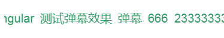

# canvas-marquee

a marquee component based on canvas

## Installation
```bash
npm i canvas-marquee -S
```

## Usage
```javascript
import Marquee from 'canvas-marquee';
var textList = ['跑马灯', '666', '233333333',
        'javascript', 'html', 'css', '前端框架', 'Vue', 'React',
        'Angular', '测试跑马灯效果'
    ];
var opts = {
    id:'canvas',
    data:textList,
    top:20,
    offset:1,
    gap:10,
    font:'20px Arial',
    color:'#339966'
};
var marquee = new Marquee(opts);
marquee.draw();
```

## options
Parameter | Type |Default| Description
--------- | ---- | ------|-----------
id | `string` |  | the canvas element’s id
data | `string` |  | the tests to show in canvas
top | `function` |  | text top offset in canvas
offset | `string`| `1` | text move step
gap | `number` | `0` | text item gap
color | `string` |  | text color
font | `string` |  | text font
start | `string`/`number` | `left` | text start point

## preview
